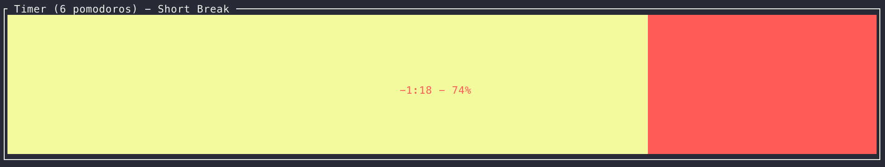
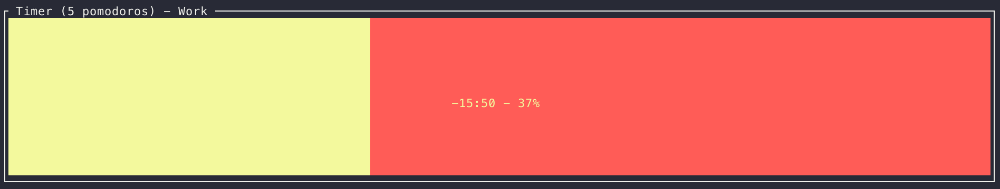

# CLI Tomato timer
## built in rust

This is based on [the pomodoro technique](https://en.wikipedia.org/wiki/Pomodoro_Technique), where you have work sessions then breaks.
The default is to have 25 minutes doing work then 5 minutes of break. You do this until you have completed 4 work sessions which is when you get a longer break (default 20 minutes).

## Running

[Install rust](https://rustup.rs/).

Clone/Download this repo, then inside the directory: `cargo run --release`.

To install run the command `cargo install --path ./ --force` (from within the directory), then you can type `tomato` to start the timer.

Tested on mac os, should work fine on Linux, windows support is untested (probably won't work).

## Commands

`q` -> quit

`p` -> pause

`→` (right arrow) -> Skip to next state

`←` (left arrow) -> Revert either to start of current state or previous state (if already ~at start of current state)

`l` -> If on short break, it becomes a long break

## Config

It is possible to configure the timer to whatever suits your personal needs.

To override the default settings, the config file must either be at `$HOME/.config/tomato_timer.conf` or you may run the program with `--config ${CONFIG_FILE_PATH}`.

The values must be in `key=value` format, where lines starting with `#` and empty lines are ignored.

You can find example config files in the  `example_config_files` folder, particularly `complete.conf`.
